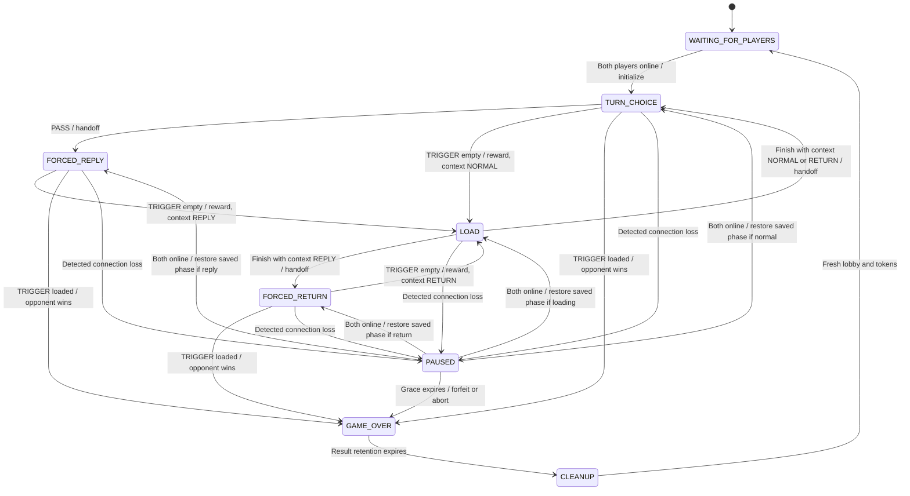

# Server State Machine Specification — Draft v1

**Project:** CS 457 Term-Project  
**Author:** Andrew Barton (design decisions developed with ChatGPT)  
**Updated:** 2026-10-02  
**Status:** Review draft. This filename preserves the requested spelling.

Use with [protocol_blueprint.md](protocol_blueprint.md). Its D1–D9 choices remain proposals. This document specifies behavior, not a threading library or socket implementation.

## 1. Authoritative state

| Server field | Type / initial value | Purpose / visibility |
|---|---|---|
| match_id | Opaque MatchId | Identifies one lobby/match. Public. |
| phase | Phase; WAITING_FOR_PLAYERS | Current lobby/game state. Public. |
| state_revision | Nonnegative integer; 0 | Increases on accepted mutations. Public. |
| turn_id | Null until match start, then integer 1 | Increases at every handoff; does not change merely when the same player's shot enters LOAD. Public. |
| active_player_id | Null until start; randomized P1/P2 | Public. |
| cylinder | Six slots; one randomly loaded at match start | Server only. Each shot independently samples uniformly from all six slots. |
| inventory[player] | Proposed initial 0 | Private to owner and server. |
| reward_index[player] | Proposed initial 0 in [0,3] | Server only; indexes [1,2,4,5]. |
| load_context | NORMAL, REPLY, RETURN, or null | Remembers which kind of shot survived; server only. |
| dare_initiator | PlayerId or null | Retained through the forced exchange; server only. |
| saved_phase | Active Phase or null | Exact phase to restore after interruption. Public as resume_phase while paused. |
| sessions | Seat, token, current connection, status, deadline | Credentials server/owner only; connection status public. |
| terminal_result | Null or fixed winner, loser, reason, terminal revision | Immutable once resolved. Public. |

Inventory and reward cycle are per player, not per global turn. There is no survival reward for PASS. No loaded chamber can become empty except through a fatal shot; that shot ends the two-player match.

## 2. Diagram

The main diagram shows gameplay. Transport loss overlays any active phase with PAUSED; section 5 defines exact restoration and expiry.

An intentional DISCONNECT reaches GAME_OVER from every active phase, including PAUSED; it is omitted from individual arrows to keep the diagram readable. Protocol errors do not advance gameplay.

## 3. States and accepted actions

| State | Active player's gameplay actions | Meaning |
|---|---|---|
| WAITING_FOR_PLAYERS | None | Seats can join or resume; both must be online before start. |
| TURN_CHOICE | TRIGGER, PASS | Ordinary turn. |
| FORCED_REPLY | TRIGGER | Opponent responds to the dare. |
| FORCED_RETURN | TRIGGER | Original passer takes their obligatory shot after opponent survives and finishes loading. |
| LOAD | LOAD, END_TURN | Surviving shooter makes one loading decision. LOAD is offered only with positive inventory; capacity is validated privately. |
| PAUSED | None | Exact active phase/turn retained while recovering connections. |
| GAME_OVER | None | Outcome fixed; result may be delivered on resume during retention. |
| CLEANUP | None | Invalidate credentials, clear state, then open a new lobby. Internal transient state; not a wire Phase. |

Only the active player's bound current connection may submit gameplay actions. Wrong-state/out-of-turn requests produce ERROR and no gameplay mutations.

## 4. Gameplay transition specification

| ID | Starting state / input / guard | Atomic effects | Next state / output |
|---|---|---|---|
| T1 | Lobby; two occupied seats online | Initialize cylinder, inventories/cycles; randomly select starter; turn_id=1; increment revision | TURN_CHOICE; GAME_START then per-player STATE_UPDATE/MATCH_STARTED |
| T2 | TURN_CHOICE; valid PASS | Record initiator; hand off to opponent; increment turn and revision; do not reward or modify cylinder | FORCED_REPLY; STATE_UPDATE/PASSED |
| T3 | Any shooting phase; valid TRIGGER; sampled slot empty | Credit reward[index] to shooter; advance index modulo 4; record NORMAL/REPLY/RETURN context; increment revision | LOAD, same shooter and turn; STATE_UPDATE/SURVIVED |
| T4 | Any shooting phase; valid TRIGGER; sampled slot loaded | Remove bullet; eliminate shooter; freeze opponent win and SHOT result; increment revision; no reward/loading | GAME_OVER; terminal STATE_UPDATE then GAME_OVER |
| T5 | LOAD; valid LOAD | Deduct count; fill count randomly selected distinct empty slots; advance according to load_context; increment turn and revision | REPLY -> FORCED_RETURN; NORMAL/RETURN -> TURN_CHOICE; STATE_UPDATE/TURN_READY |
| T6 | LOAD; valid END_TURN | Spend nothing; advance according to load_context; increment turn and revision | Same destination rules as T5; STATE_UPDATE/TURN_READY |
| T7 | Active/paused match; intentional DISCONNECT | Sender forfeits; opponent wins even if disconnected; freeze FORFEIT result | GAME_OVER; results to writable peers; departing client's acknowledgement/closure |
| T8 | Invalid well-framed gameplay request | No cylinder/inventory/cycle/turn/phase change | ERROR; current private snapshot to sender |
| T9 | Detected transport loss during active phase | Preserve current phase/turn/context; reserve seat; start that session's deadline; increment revision | PAUSED; connected opponent receives CONNECTION_LOST snapshot |
| T10 | Valid resume before deadline | Bind new connection, fence old connection, restore retained data; increment revision | WELCOME and immediate snapshot; restore saved phase only if both online |
| T11 | Active player's grace expires; opponent online | Freeze win for opponent, loss for absent player, RECONNECT_TIMEOUT | GAME_OVER; terminal snapshot and GAME_OVER |
| T12 | Active player's grace expires; opponent disconnected | Freeze no-winner MATCH_ABORTED result | GAME_OVER; deliver if any peer later resumes during retention |
| T13 | Terminal retention expires | Send MATCH_CLOSED where possible; close connections; invalidate tokens; clear state | CLEANUP -> fresh WAITING_FOR_PLAYERS |

T5/T6 handoff details:

- NORMAL: hand off to opponent normally.
- REPLY: hand off to the original passer, preserving dare_initiator until the exchange finishes.
- RETURN: hand off to opponent normally and clear dare_initiator.
- Clear load_context after handoff.

Every accepted action and its consequence complete before the next event is processed. This serial resolution contract does not select multithreading or selectors; that architecture decision belongs to a later sprint. Revalidate all guards at execution time.

## 5. Connection and lobby behavior

Proposed grace is 30 seconds from detected loss, using server monotonic time. Resume at the deadline is too late. A connection failure detected after an accepted MOVE does not roll it back: restore the resulting state, not the last screen the client remembers.

PAUSED is a temporary overlay. Preserve active_player_id, turn_id, load_context, dare_initiator, inventory, reward positions, and cylinder. A successful resume restores them without sampling or rewarding again. If the other player remains absent, stay PAUSED. No gameplay input is accepted while paused.

Each disconnected seat has its own deadline. Later interruptions must not overwrite the first absent player's deadline. Invalid credentials do not extend deadlines. Process the earliest expired deadline first. Once a terminal result exists, no later loss, timeout, or disconnect changes it. Exact terminal-result revision is retained even if later connection changes increase the snapshot revision.

Before match start: interruption reserves the lobby seat for grace without changing WAITING_FOR_PLAYERS. Expiry or deliberate DISCONNECT releases that seat and token. An existing connected player remains waiting; an unbound client can claim the freed seat. No lobby forfeit creates a match victory.

After match end: hold terminal state for the proposed 30-second retention. A disconnected player with an unexpired retained session can resume, receive WELCOME, their terminal snapshot, and GAME_OVER. Invalidate all sessions at cleanup. No automatic replay/rematch is specified.

If server detection misses a silent broken link, recovery cannot begin yet. The heartbeat/liveness policy remains an explicit implementation decision, not an assumed behavior.

Transport observations are classified by protocol section 6.1 before triggering T9. EOF from a positive-size receive and fatal established-socket read/write errors cause interruption; would-block, short positive I/O, retryable interruption, and receive polling timeouts do not. A TCP half-close without a processed valid DISCONNECT is interruption, not forfeit.

Retirement must follow protocol R5/R6 exactly once per connection binding. Duplicate/old callbacks cannot extend deadlines or detach a resumed connection. If loss occurs while PAUSED, preserve saved_phase/load_context rather than overwriting saved_phase with PAUSED. An already committed T3–T6 action remains committed when its notification write fails. Complete received frames preceding EOF are processed in stream order until intentional/protocol closure; discard any final incomplete suffix. Output/cleanup budgets remain proposal D9.

## 6. Invariants

- **I1:** Exactly one active player during running/paused gameplay; none in lobby/terminal states.
- **I2:** Bullet count is between 0 and 6; during live two-player gameplay it is at least 1.
- **I3:** Inventory is nonnegative. Loading transfers bullets from inventory to distinct empty chambers without duplication.
- **I4:** Each successful trigger survival earns exactly one reward and advances only that player's cycle once.
- **I5:** PASS never rewards, fires, or loads; it starts the forced exchange.
- **I6:** FORCED_REPLY and FORCED_RETURN cannot accept PASS. Consecutive passes are impossible.
- **I7:** An incorrect dare does not automatically eliminate its initiator. They receive their own forced random shot.
- **I8:** A full cylinder makes the next accepted TRIGGER fatal, whoever the shooter is.
- **I9:** Session restoration never executes the previous action again.
- **I10:** Snapshots obey protocol A3/A4 privacy even on errors, reconnection, and game over.
- **I11:** Once resolved, the terminal winner/loser/reason never change.
- **I12:** Rejected gameplay messages do not mutate gameplay state. Transport closure may separately change connection state.

## 7. Behavioral conformance scenarios

These are specification examples for future verification, not executable tests or socket code. Controlled random outcomes are used to demonstrate branches.

| ID | Given / action sequence | Required outcome |
|---|---|---|
| S1 | P1 normal PASS; P2 forced TRIGGER hits bullet | P1 wins, P2 loses. No survival reward or loading for P2. |
| S2 | P1 PASS; P2 survives and loads/ends; P1 forced TRIGGER hits bullet | P2 earns one appropriate reward before P1's shot; P2 wins. |
| S3 | P1 PASS; P2 survives and loads/ends; P1 survives and loads/ends | Both receive their own rewards; P2 resumes TURN_CHOICE; neither is automatically eliminated. |
| S4 | P2 attempts PASS in FORCED_REPLY, or P1 in FORCED_RETURN | ACTION_NOT_ALLOWED; phase, turn, inventory and cylinder unchanged. |
| S5 | One player survives five trigger pulls without spending | Awards 1,2,4,5,1; inventory totals 1,3,7,12,13; next reward is 2. Other player's cycle unchanged. |
| S6 | Inventory 7, two empty chambers; LOAD count=2 | Inventory becomes 5; cylinder full; handoff occurs. LOAD count=3 instead must reject without mutation. |
| S7 | Player ends loading without spending | Inventory and cycle retained; handoff occurs with context-based forced/normal phase. |
| S8 | Full cylinder; next active player passes normally | Opponent must shoot and dies; the player who filled the cylinder is not guaranteed to win merely by filling it. |
| S9 | Disconnect during FORCED_REPLY, FORCED_RETURN, or LOAD; reconnect before deadline | Exact phase/context/turn restored, own inventory delivered, no pass newly enabled and no extra reward. |
| S10 | TRIGGER accepted and survives; response lost; client reconnects | Snapshot already shows LOAD and awarded inventory; no resampling. Old-revision retry receives STALE_STATE if attempted. |
| S11 | Current session deliberately DISCONNECTs during active or paused play | Immediate FORFEIT; no grace, opponent wins; result retained if opponent currently absent. |
| S12 | Valid reconnect before deadline vs at exact deadline | Before succeeds; equality is expired and cannot resume active play. |
| S13 | One absent player's grace expires with opponent online | Online opponent wins through RECONNECT_TIMEOUT. |
| S14 | Both absent; earliest grace expires | MATCH_ABORTED, no winner; later reconnect cannot change result. |
| S15 | Partial frames and multiple frames in one read | Only complete LF-terminated objects execute, in order; suffix retained. |
| S16 | Exactly 4,096 object bytes plus LF vs 4,097 bytes | First size accepted, second FRAME_TOO_LARGE; limits count UTF-8 bytes, not characters. |
| S17 | Opponent loads vs declines to load | Opponent-facing TURN_READY snapshot contains neither loading amount nor their inventory, cylinder count, or reward position. |
| S18 | Fatal result followed by disconnect/timeout | Original result remains unchanged. |
| S19 | Lost lobby connection resumes vs expires | Resume restores seat; expiry releases it; no match winner is invented. |
| S20 | Superseded connection sends a late MOVE after resume | It cannot mutate the rebound session or game. |

Transport-specific checks C1–C14 in protocol section 6.6 supplement S1–S20, including EOF vs intent, partial writes, recoverable exceptions, loss callback idempotency, and failed cleanup.

## 8. Review boundary

Before declaring these documents final, resolve D1–D9 and inspect schema examples against the transition table. Then record the approved version in the implementation instruction in the protocol blueprint. Any future generated implementation must explain unresolved conflicts rather than silently invent rules.
